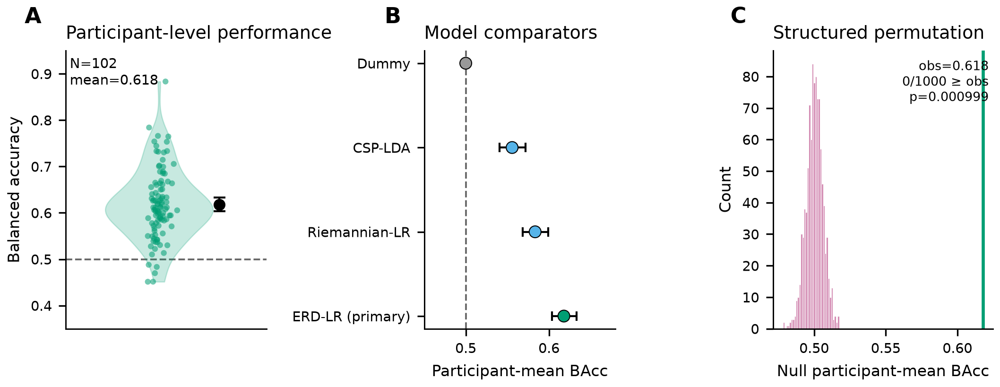

# Cross-Participant EEG Decoding of Motor Execution and Motor Imagery Reveals Sensorimotor and Protocol-State Contributions

This repository contains the analysis code, frozen configurations, tests, and publication figures for a participant-disjoint EEG study of motor execution (ME) versus motor imagery (MI) on PhysioNet EEGMMIDB. The work asks whether ME and MI can be distinguished in unseen participants, and what kinds of information support that distinction—sensorimotor physiology and protocol-state structure—under a fixed-order public dataset.

## Scientific question

Can motor execution and motor imagery be distinguished in participants the model has never seen before? And what information drives that distinction?

The analyses jointly examine:

- sensorimotor mu/beta physiology;
- pre-cue / protocol-state information;
- spatial specificity (sensorimotor vs peripheral control channels);
- robustness to artifact handling and related sensitivities.

This is **not** framed primarily as a classifier leaderboard. Decoding is used as a tool to quantify reproducible condition-associated information under the EEGMMIDB protocol.

## Main findings

Frozen primary cohort: **N = 102**.

| Endpoint | Value |
|---|---|
| Primary balanced accuracy (BAcc) | 0.617924 |
| 95% CI | [0.603553, 0.632899] |
| ROC-AUC | 0.670352 |
| Macro-F1 | 0.608638 |
| MCC | 0.242461 |
| Structured permutation (E07) | 1000 permutations; plus-one *p* = 0.000999 |
| Pre-cue control (E00) BAcc | 0.539019 |
| Post-cue − pre-cue ΔBAcc | 0.078905; 95% CI [0.065574, 0.092283] |
| Peripheral spatial-control BAcc | 0.583815 |
| Paired sensorimotor advantage ΔBAcc | 0.038235; 95% CI [0.024501, 0.052142] |
| Artifact sensitivity BAcc | none = 0.618568; 150 µV = 0.616887; 200 µV = 0.617924 |

Qualitatively, ME showed stronger mu/beta ERD than MI across the prespecified sensorimotor ROIs. Interpretation remains cautious: above-chance decoding and spatial/physiological patterns support task-linked sensorimotor contributions **in addition to** measurable protocol-state information; they do not isolate a purely neural, purely task-specific signal.

## Biological interpretation

Motor execution and imagery engage related motor systems and both alter sensorimotor mu and beta rhythms. Actual execution produced stronger ERD than imagery. Sensorimotor electrodes contained additional discriminative information relative to a matched peripheral control set.

These patterns support a **task-linked sensorimotor contribution** under the protocol. They do **not** mean the classifier isolates purely neural task-specific information free of movement-related artifacts or session structure.

## Important protocol limitation

EEGMMIDB uses fixed ordering: **execution → imagery** for matched run pairs:

| ME run | MI run |
|---|---|
| 03 | 04 |
| 05 | 06 |
| 07 | 08 |
| 09 | 10 |
| 11 | 12 |
| 13 | 14 |

Condition is therefore coupled to within-pair run position. Pre-cue decoding (E00) demonstrates measurable protocol-state information; post-cue performance is substantially stronger; physiological and spatial controls support additional sensorimotor information; yet the dataset cannot fully separate task condition from run order.

**The results support contributions from both task-linked sensorimotor physiology and protocol-state structure.** This study does not claim to have controlled away the confound.

## Dataset

Analyses use the PhysioNet [EEG Motor Movement/Imagery Dataset (EEGMMIDB)](https://physionet.org/content/eegmmidb/1.0.0/).

**Raw EEG is not distributed in this repository.** The pipeline downloads and caches EDFs locally via MNE’s EEGBCI helpers into a configurable `data_root` (default under `data/physionet_eegmmidb/`, gitignored).

Warm the cache (restartable):

```bash
eeg-me-mi download configs/full.yaml
```

For local engineering checks after data are present:

```bash
eeg-me-mi run-toy --no-download configs/toy.yaml
```

## Analysis overview

```text
EEGMMIDB
  ↓
participant eligibility
  ↓
preprocessing (8–30 Hz, 80 Hz, sensorimotor montage)
  ↓
mu/beta features
  ↓
participant-disjoint nested CV
  ↓
primary decoding (E01)
  ↓
physiology + controls (E00, E03, E05, …)
  ↓
structured permutation (E07)
  ↓
robustness / diagnostics (E05–E08, sensitivities)
```

Primary representation: **42 features** = 21 sensorimotor channels × 2 bands (mu, beta), as ERD features for E01 (log band power for E00).

## Analysis families

| Analysis | Purpose |
|----------|---------|
| E00 | Pre-cue run-state decoding control (log mu/beta power in the FIR-safe pre-cue window) |
| E01 | Primary ME/MI decoding (Dummy, ERD-LR, CSP-LDA, Riemannian tangent-LR) with nested participant-disjoint CV |
| E02 | Movement-specific / pooled unilateral–bilateral decoding on independent eligibility cohorts |
| E03 | Mu/beta ERD physiology: ROI summaries, channel maps, laterality |
| E04 | Exploratory participant heterogeneity and stability |
| E05 | Artifact-threshold sensitivity and spatial-plausibility (peripheral) control |
| E06 | First-60-s cue events vs all cue events |
| E07 | Structured matched-pair permutations (inferential support for the primary endpoint) |
| E08 | Fixed-order / drift diagnostics |

Details are frozen in `docs/final_analysis_plan.md` and recorded in `docs/definitive_execution_report.md`.

## Repository structure

```text
src/eeg_me_mi/     Analysis package (download, preprocess, features, CV, E00–E08 runners)
configs/           Frozen YAML configs (toy, pilot, full, TRUBA)
tests/             Automated integrity and unit tests
scripts/           Post-definitive / sensitivity helper scripts
slurm/             SLURM/TRUBA job scripts (e.g. E07)
results/           Local and selectively versioned machine-readable outputs
figures/           Publication figures (v1 layout)
figures_v2/        Current main + supplementary publication figures and generators
docs/              Plans, audits, execution reports, captions, tables
historical/        Legacy Colab/reanalysis code retained for provenance
```

Local-only (gitignored): `data/`, `cache/`, `.venv/`, review ZIP packages, most regenerated `results/*` dumps.

## Installation

Requires Python ≥3.11 and <3.15.

```bash
git clone https://github.com/CyrilleMesue/eeg-me-mi.git
cd eeg-me-mi
python -m venv .venv
source .venv/bin/activate
pip install -e ".[test]"
```

The console entry point is `eeg-me-mi`.

## Quick local validation

```bash
PYTHONPATH=src .venv/bin/pytest -q
eeg-me-mi run-toy --no-download configs/toy.yaml
```

The toy config uses early participant IDs for engineering validation only (not performance-selected). Omit `--no-download` on a fresh machine to fetch the required EDFs first.

## Full analysis

| Scope | How |
|---|---|
| Ordinary full matrix (E00–E06, E08; skip long E07) | Local workstation is the default environment: `eeg-me-mi run-full --skip-e07 configs/full.yaml` |
| Dry-run / config check | `eeg-me-mi run-full --dry-run --skip-e07 --no-download configs/full.yaml` |
| E07 ×1000 structured permutations | Long job; typically submitted via SLURM on TRUBA using `slurm/e07_final.sbatch` (or `eeg-me-mi run-e07 ...`). TRUBA access is **not** required to inspect frozen outputs or run ordinary analyses when results and figures are already present. |

Definitive execution provenance (cohorts, metrics, E07 wall time) is summarized in `docs/definitive_execution_report.md`.

## Reproducing figures

Current publication layout lives under `figures_v2/`.

```bash
PYTHONPATH=src python figures_v2/scripts/generate_all_figures_v2.py
PYTHONPATH=src python figures_v2/scripts/validate_figures_v2.py
PYTHONPATH=src python figures_v2/scripts/generate_supplementary_final.py
PYTHONPATH=src python figures_v2/scripts/validate_supplementary_final.py
```

- Main figures: `figures_v2/main/`
- Supplementary figures: `figures_v2/supplementary_final/`
- Captions / review notes: `docs/publication_figure_captions_v2.md`, `docs/supplementary_figure_captions_final.md`

## Tests and validation

Verified in this repository cleanup pass:

```text
73 passed
```

Integrity coverage includes leakage-oriented CV checks, protocol/eligibility tests, remediation tests, and post-definitive control tests (see `tests/`).

## Reproducibility

- Fixed YAML configs under `configs/`
- Participant-disjoint nested CV with stored fold assignments
- Frozen primary analysis endpoints and windows (FIR-safe bounds)
- Structured matched-pair permutations (E07) with plus-one *p*
- Provenance and execution reports under `docs/` and selected `results/` trees
- Deterministic seeds where configured (primary seed **2026** in frozen configs)

Scientific freeze tag: `analysis-complete-pre-manuscript` (commit `6d0ce7a`).

## Computational requirements

Ordinary decoding/physiology analyses are designed for a normal workstation once EDFs are cached. Exact runtime depends on CPU and whether caches exist.

For the frozen E07 ×1000 TRUBA job (indicative):

- wall time ≈ 2 h 24 min
- MaxRSS ≈ 7.9 GiB

These numbers depend on hardware, QOS constraints, and software versions; see `docs/definitive_execution_report.md`.

## Figures

Representative main figure (current v2 layout):



Browse `figures_v2/main/` for Figures 1–5 and `figures_v2/supplementary_final/` for supplementary panels.

## Citation

Manuscript in preparation.

> Cross-Participant EEG Decoding of Motor Execution and Motor Imagery Reveals Sensorimotor and Protocol-State Contributions.

See also `CITATION.cff`.

## License

No `LICENSE` file is currently included in this repository. Please contact the authors before redistribution beyond standard GitHub use of the public source tree.

## Contact

Public repository: [https://github.com/CyrilleMesue/eeg-me-mi](https://github.com/CyrilleMesue/eeg-me-mi)
